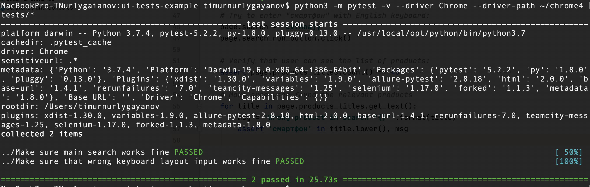

Introduction
------------

This repository contains basic example of usage PageObject
patter with Selenium and Python (PyTest + Selenium).

Files
-----

[conftest.py](conftest.py) contains all the required code to catch failed test cases and make screenshot
of the page in case any test case will fail.

[pages.py](pages.py) contains PageObject pattern implementation for Python.

[elements.py](elements.py) contains helper class to define web elements on web pages.

How To Run Tests
----------------

1) Install all requirements:

    
    pip3 install -r requirements
    

2) Download Selenium WebDriver from https://chromedriver.chromium.org/downloads (choose version which is compatible with your browser)

3) Run tests:

    
    python3 -m pytest -v --driver Chrome --driver-path ~/chrome tests/*
    

   
